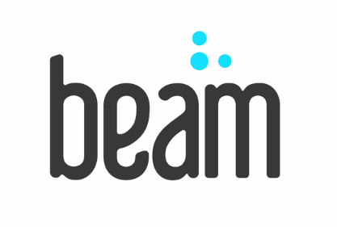
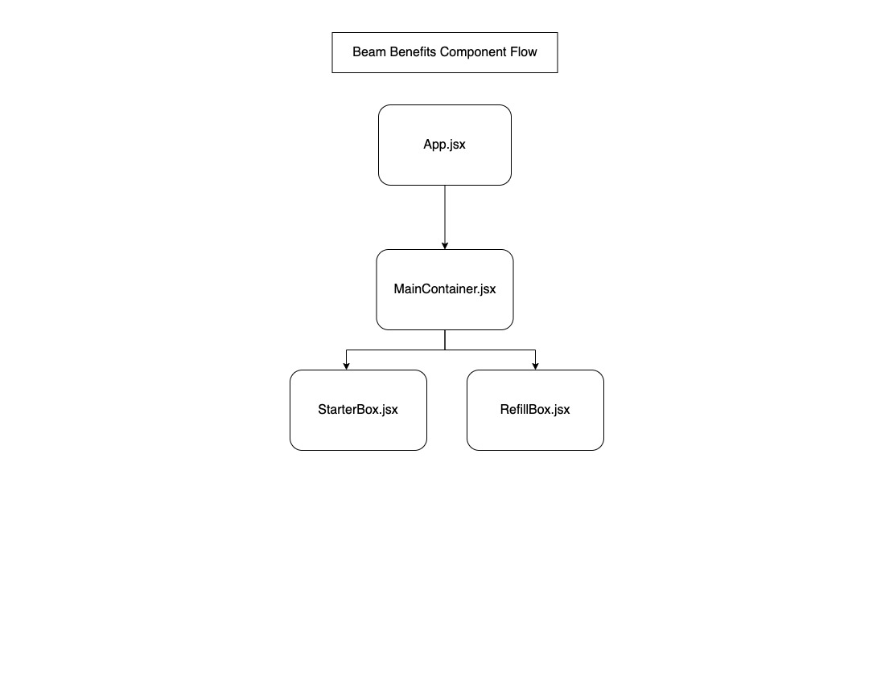

<h1 align="center">
  <br>
    
    <br>
    <br>
  Beam Benefits Take Home Assessment
  <br>
</h1>

## Description

Hello! I wanted to create an application that was very similar to the one shown to us in the README of the kata, but I also wanted to keep the component structure of the application incredibly modular as well. 

On a personal level I felt that React was the obvious choice as React was perfect for the SPA nature of this application, and React's natural reusability of its components appealed to my vision. I initialized the kata using Vite due to Vite's ability to limit performance bottlenecks due to module sizes, I do recognize that this application will likely have little to any performance bottlenecks, but I'm a firm believer that any codebase should not only be easy to understand on a human level, but also incredibly easy to build on top, and Vite helps alleviate some of these issues. In terms of styling I wanted to keep it simple and use SCSS for easy variable declarations for the colors Beam gave us. 

I decided to begin with a simple container that would hold all of our general components allowing for any future developer to itereate over the codebase easily due to the application's interchangeable nature. The initial ShippingScreen container holds all of our components, it is also the container that will initialize the Beam Benefits endpoint. From there you'll see according to the component flow diagram below, we prop drill down our data from the initial ShippingScreen to the StarterBox and RefillBox components. 

<br>

## Component Flow




<br>

## Getting Started


### Install dependencies
```bash
npm install
```

### Run in development
```bash
npm run dev
```